# jwt
https://start.spring.io/
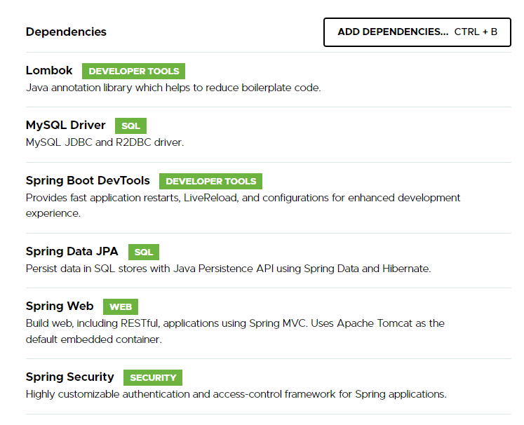

go to https://mvnrepository.com/
download java JWT 
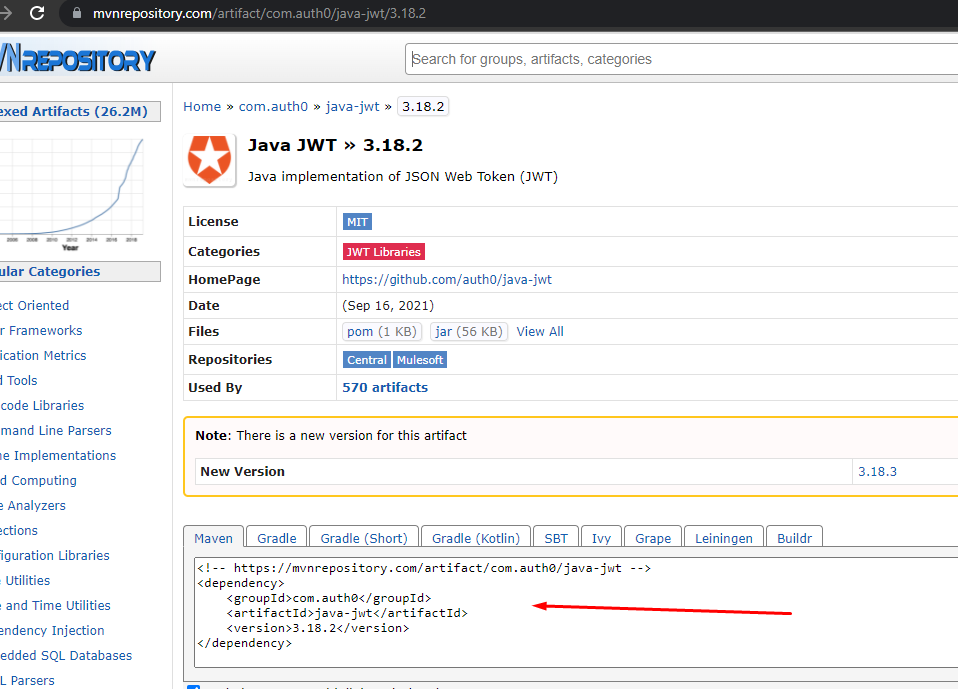
copy the below
<dependency>
<groupId>com.auth0</groupId>
<artifactId>java-jwt</artifactId>
<version>3.18.2</version>
</dependency>
and past the above dependency into pom.xml

JWT= Base64(Header).Base64(Payload).Base64(HS256Ecription(lowSig))

Set up application.properties
and create one RestController for testing.
#Step 1
Create user model and run springboot to create user table
#Step 2
Create SecurityConfig class
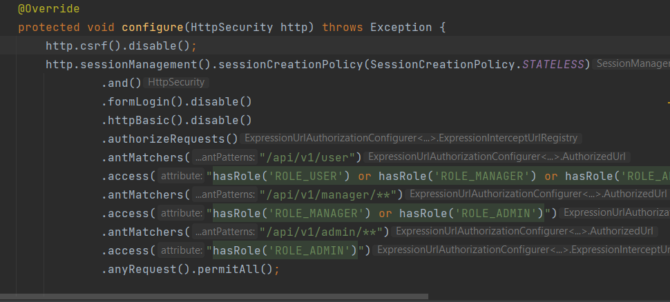 
That is basic security setting for JWT server.
We are not using formlogin and httpBasic and no session as well.
#Step 3
Create CorsConfig class under config package
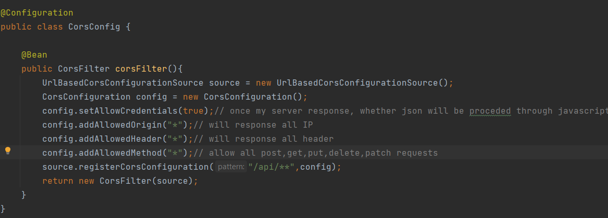
After Creating CorsConfig class, need to add CorsConfig
into SecurityFilter inside of Security config.

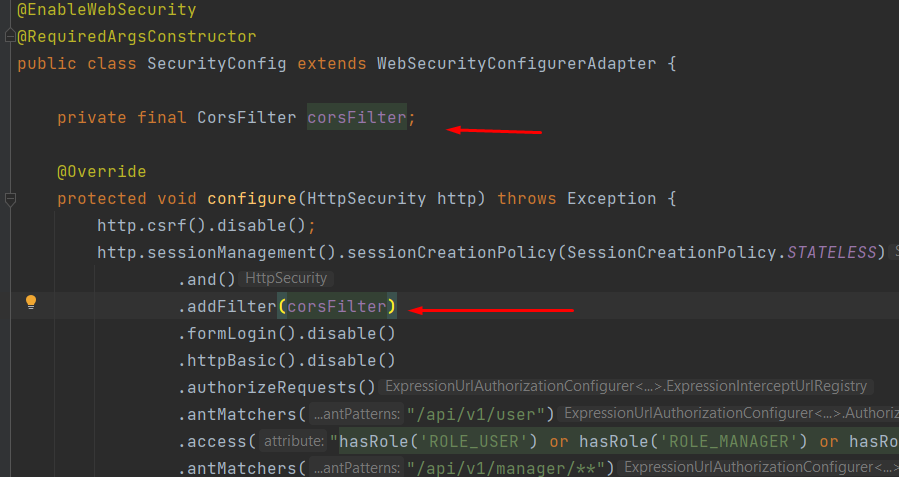
Therefore, This server will allow all request ( Cross Origin)

For more information about CORS(Cross- Origin Resource Sharing)
https://developer.mozilla.org/en-US/docs/Web/HTTP/CORS

you can use @CrossOrigin on every RestController. However, this case is not working
once the program needs authentication. So, For CORS, we need to creat CorsConfig class
and add it to the security filter.

#Step4
you can access all pages after the above steps.
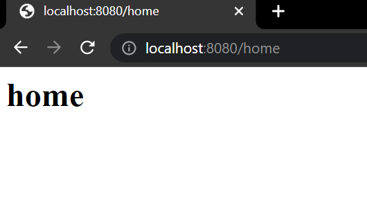
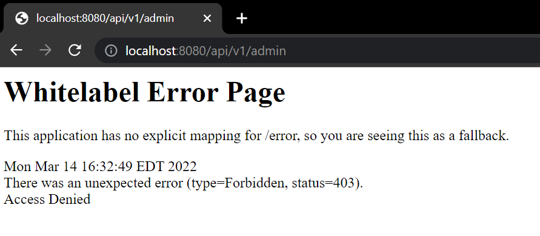
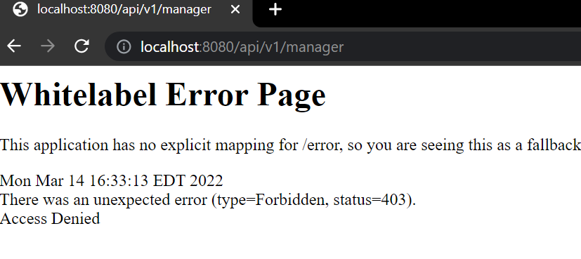
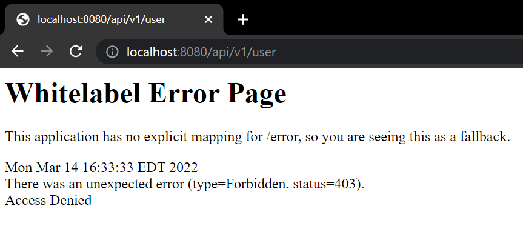

[For understanding to use .httpBasic().disable()]  
httpBasic()-> once client send a request to server for authenticaton
server response a header having "ID, Password" information. That is HttpBasic.
[JWT Bearer Authentication ]
HttpBasic is not safe. It can be exposed user id/pw.
so, Server response a Token having ID/PW.  
That is Bearer Authentication. This created token has some specif time for expiration.
Bearer is creating token with JWT.
To enable Bearer, need to disable HttpBasic and formLogin and keep session Stateless.

#[Experiment: Will log in and get a token. with that token, you will log in]
Step 1: Adding Filter
- Create your own filter implemented Filter and register the created filter to
Spring Security config. To register the filter to the security, you have to use
addFilterBefore or addFilterAfter.
For example.
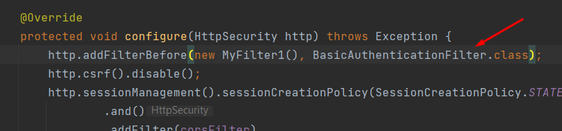
Run the created filter before BasichAuthenticatonFilter running. 

check localhost:8080/home 

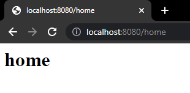

-check filter1 on console.

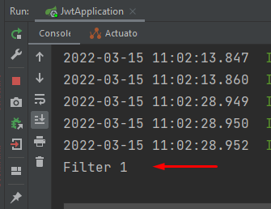

Registering your own filter to Security config like the above is not good approach. 
Create FilterConfig.java file to register your own filter.
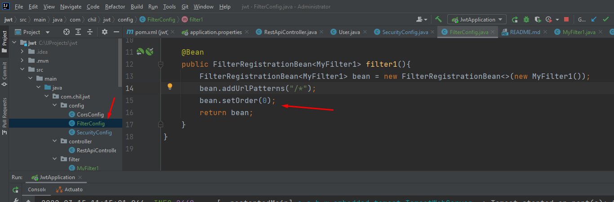
Run application and go to localhost:8080/home and check "filter1" is appearing on console. 
you can add more filters as you create MyFilter2.java and so on.
Go to FilterConfig.java and add another method like below
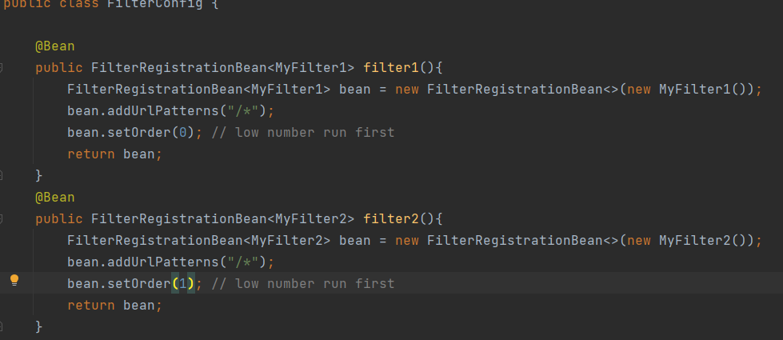
and run and send a request to server=>localhost:8080/home
Then, filters are running
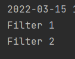 

Depending on situation, you can add your own filter to security configuration.
Registered filter inside security configuration run faster than your own filter registeration.
What if you want a filter before spring security, then you have to add like below.

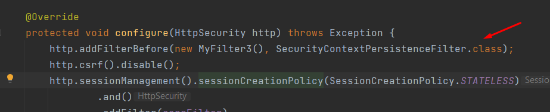

[see Spring Security Filter Chain order]
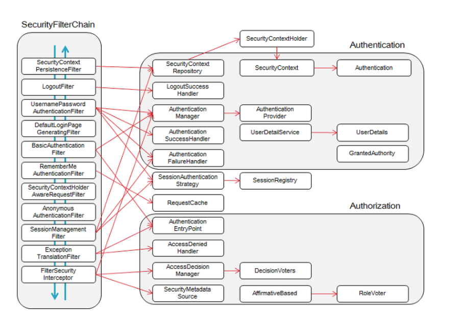
# You will be using this Filters for Token Process

# Test Temporary Token
Step 1. will send a token request through postman and Myfilter 1 will 
grab the request and filtering the request Header's value
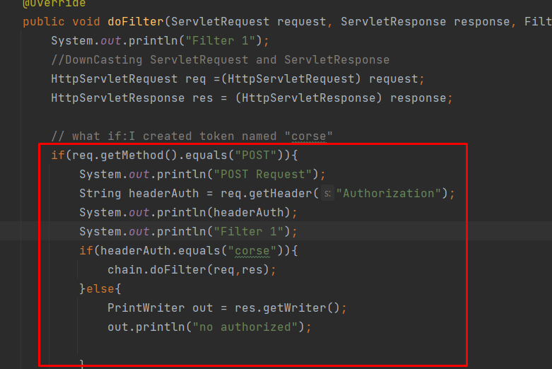
In here, we use "corse" as Header key(Authorization)'s value.

In order to use POST, need to create one method inside of controller.
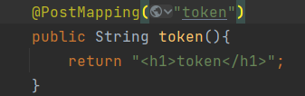

post man testing screen
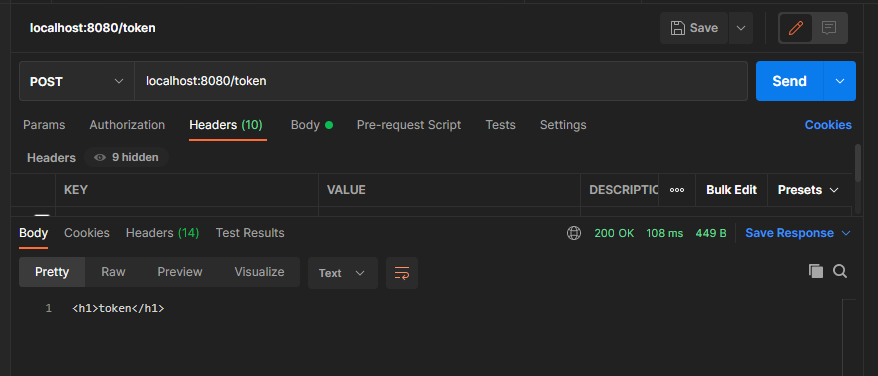

The above example, Filter3 is always running before security config.
Therefore, Filter3.java has all current filter setting. 

# Token creation and process
our token "corse" should be created. if user login process completed with normal
user id/pw, then need to create a token and response the token.
Whenever client send a request, the request should have token as value of Authorization in Header.
Once server receive the request with header having token, need to verify whether the token was originally created in Server
(RSA, HS256)

